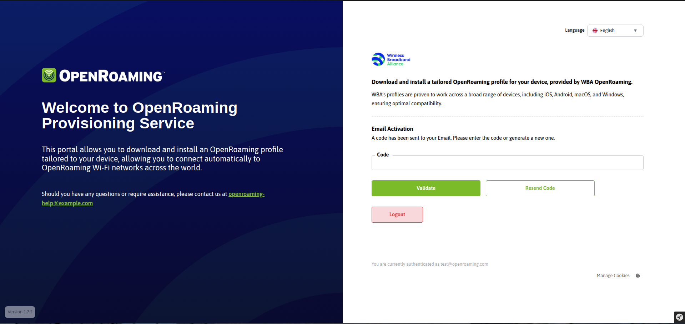

# Overview of the Platform User Interface

## How the Platform Works - Main Page

### 1. Main Page Overview - Live Mode

The main page in platform mode (**Live**) provides a user-friendly interface for users with
individual accounts.
The page welcomes visitors with a customisable banner that includes the company logo, welcome text,
and a brief summary of the portal's features.

Depending on the settings made by the administrator, users can log in using multiple authentication methods such as
SAML, Google, and Register authentication.
The main page provides a smooth and customized experience, allowing users to
safely and quickly connect to Wi-Fi networks.

### 2. Verification Step

The platform begins the verification procedure to validate the user after registration or when in demo mode. The
verification system sends an email or sms to the user's provided email or phone number address.
This procedure contains a unique verification link
or code that the user must click to complete the verification process.

The verification phase is a critical to validate the user's identity and makes sure their email or phone number
address is valid on the portal.
The user validates ownership of the email account and shows permission to use the OpenRoaming
Provisioning Portal by clicking the verification link or by submitting the code given on the email. This procedure
improves the platform's security by preventing unwanted access.

### 3. After Verification

After successfully completing the verification process, the user will be directed to this page.
The actions taken during the verification process depend on the mode in
which the user created their account.

#### 3.1 Live Mode

If the user created an account in live mode (platform mode set to **Live**), they will receive an email with
essential account information. The email includes a link to return to the verified portal, a verification code, and a
randomly generated password. With this information, the user can log in securely to the OpenRoaming Provisioning Portal.

#### 3.2 Demo Mode

Users who registered an account in demo mode (platform mode set to **Demo**) can access the verified portal instantly.
Because
demo mode allows users to explore the site without registering individual accounts, the verification procedure makes
sure that the user's session is safe.
Based on the submitted email, the system creates a demo profile that grants access
to the portal's features while keeping user data secure.

### 4. Download Profile

At the final stage of the process, users have the option to download a profile customized for their specific operating
system.
The OpenRoaming Provisioning Portal has intelligent auto-detection that identifies the type of device being
used.

When the user clicks the "Download" button, the portal generates a profile with information based on the user's account
information.
This profile is designed to improve the Wi-Fi experience by providing smooth connectivity and increased
security.

The downloaded profile includes all the essential settings and variables to make connecting to Wi-Fi networks easier.
The OpenRoaming Provisioning Portal improves Wi-Fi connectivity by giving a user-specific profile, making it easier and
more convenient for consumers and companies.

With this final step, users can effortlessly connect to Wi-Fi networks in various contexts, whether it's in public
hotspots, corporate networks, or events and conferences, experiencing the full benefits of the OpenRoaming Provisioning
Portal.
Say goodbye to manual login problems and enjoy a seamless, secure, and personalized Wi-Fi experience! 📶🔒🌐

## Admin Dashboard Overview

The OpenRoaming Provisioning Portal also has an easy and intuitive admin interface, allowing administrators to easily
administer and customize the platform.
The admin dashboard includes a number of features and tools that help simplify
the Wi-Fi provisioning process and guarantee that it runs smoothly. Here's an overview of the admin dashboard and its
primary features:

### 1. Admin Login

The admin dashboard is only accessible after a secure login, accessible via https://<portalurl>/login/admin
To access the dashboard, administrators must provide their
credentials **(default is: admin@example.com/gnimaornepo)**. The login page provides authorized users with a secure and private
entry point to control the platform.

### 2. Admin Page

Administrators are presented with the dashboard overview after successfully logging in.
Administrators may quickly
access/search information about the users on the portal, the system customization, the current applied settings and
other essential data.
And if needed, they can check all the statistics of the portal.
Statistics like, profiles downloaded in which device, what method of authentication the users used, among others.

For more information please contact: openroaming@wballiance.com