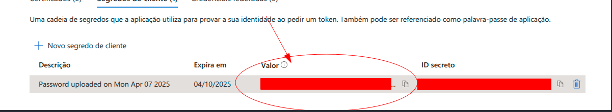

# Microsoft Client ID & Secret Credentials

Follow these steps to obtain your **Microsoft Client ID** and **Microsoft Client Secret**:

---

## Step 1: Go to the Microsoft Azure Portal
1. Open your browser and navigate to the [Microsoft Azure Portal](https://portal.azure.com/).
2. **Sign In** with your Microsoft account.

---

## Step 2: Access the App Registrations Section
1. In the Azure Portal, open the **Navigation Menu** (☰) in the top-left corner.
2. Navigate to **Azure Active Directory** > **App Registrations**.
3. Click **+ New Registration** at the top to create a new application.

---

## Step 3: Register the Application
1. Provide the following details for your new application:
    - **Name**: Enter a name for your app (e.g., "Symfony App").
    - **Supported Account Types**: Choose who can access your app:
        - **Accounts in this organizational directory only** (Single tenant)
        - **Accounts in any organizational directory** (Multi-tenant)
        - **Accounts in any organizational directory and personal Microsoft accounts** (Multi-tenant and Microsoft accounts)
    - **Redirect URI**: Add your application's callback and checker URL's:
        - Examples: 
          - `https://yourportaldomain/connect/microsoft`
          - `https://yourportaldomain/connect/microsoft/check`
2. Click **Register** to finalize.

---

## Step 4: Configure the API Permissions
1. After registration, go to the **API Permissions** tab in your application's setup.
2. Click **+ Add a permission**.
3. Use **Microsoft Graph** or other APIs depending on your need and select the necessary permissions (e.g., email, offline_access).
4. Grant admin consent for the chosen permissions if needed.

---

## Step 5: Generate the Client Secret
1. Go to the **Certificates & Secrets** section of your application.
2. Click **New Client Secret**.
3. Add a **Description** (e.g., "Symfony App Secret") and set an expiration period.
4. Click **Add** to generate the secret.
5. Copy the **Client Secret** — this will only be shown once. 

**Please make sure you copy the value on the left**


---

## Step 6: Obtain the Client ID
1. Go back to the **Overview** section of your app.
2. Copy the **Application (Client) ID** shown on the page.

---

## Step 7: Add the Values to Your Symfony Application
In the root directory of your portal and store the credentials in the `.env` file like this:

```dotenv
MICROSOFT_CLIENT_ID=your_client_id
MICROSOFT_CLIENT_SECRET=your_client_secret
```

These credentials will integrate into your portal login for Microsoft Authentication or API calls.
